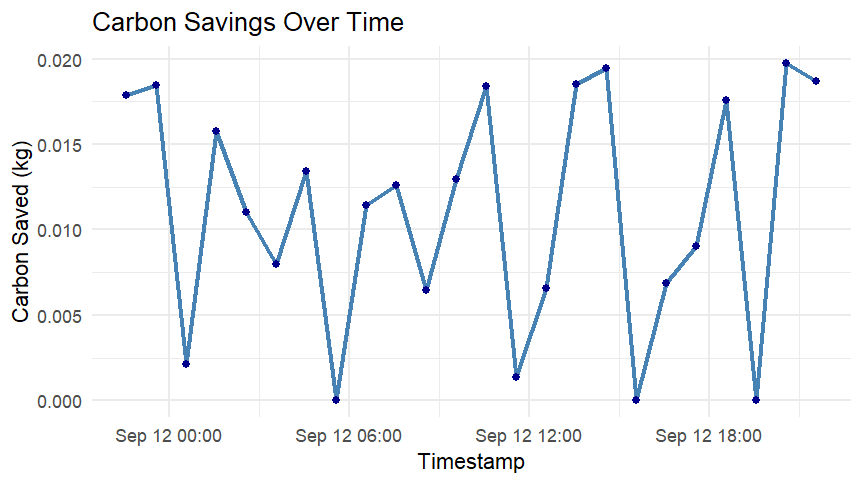

# BurstLogic Internship – Hina

This repository contains reproducible burst simulations, ESG reflections, and EEG-compatible data aligned with OpenWorm standards.

## Burst Simulation Chart

## Files Included

- `burst_output_v1.rds`: RDS output from burst simulation
- `burst_output_v1.csv`, `v2.csv`, `v3.csv`: CSV exports
- `Rplot.png`: Visualization of burst frequency and carbon savings
- `week1_reflection.md`: Internship reflections and ESG commentary

## Reproducibility

Built with R and Python. Includes `.Rproj` for RStudio compatibility and versioned outputs for audit trail integrity.

## Disclaimer
This repository reflects personal internship work using simulated data and public tools.  
No proprietary or confidential OxygenWealth materials are included.
